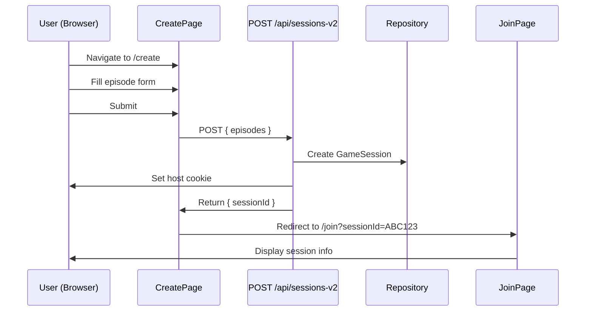
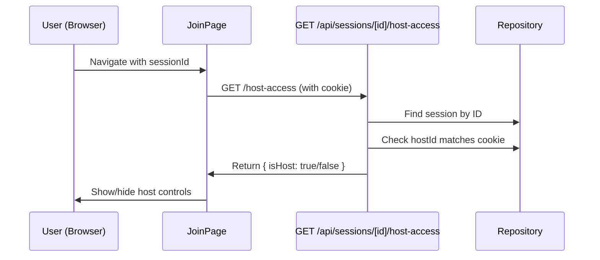

# Data Model: Simplify Screen Flow

**Feature**: 003-simplify-screen-flow
**Date**: 2025-11-10

## Overview

This feature is a **presentation layer refactoring** that removes unused page routes. **No data model changes are required**. All existing entities, repositories, and backend logic remain unchanged.

## Existing Entities (Preserved)

### GameSession

**Location**: `/src/server/domain-v2/entities/GameSessionV2.ts`

**Purpose**: Represents a game session with episodes and participants.

**Key Attributes**:
- `sessionId`: string - Unique 10-character identifier
- `episodes`: Episode[] - List of game episodes
- `hostId`: string - Identifier for the host participant
- `state`: 'CREATED' | 'STARTED' | 'ENDED' - Session lifecycle state
- `createdAt`: Date - Session creation timestamp
- `expiresAt`: Date - Session expiration (24 hours from creation)

**Operations**:
- `create()`: Factory method to create new session
- `start()`: Transition from CREATED to STARTED
- `end()`: Transition to ENDED state

**Repository**: `InMemoryGameSessionRepositoryV2`

**Persistence**: In-memory with 24-hour TTL, automatic cleanup

**Impact of Feature**: ✅ **NO CHANGES** - Sessions created via POST /api/sessions-v2 as before

---

### Episode

**Location**: `/src/types/episode.ts`

**Purpose**: Represents a single game episode (statement to be judged).

**Key Attributes**:
- `id`: string - Episode identifier
- `content`: string - The statement text
- `order`: number - Display order in game

**Validation**:
- Content must not be empty
- Maximum 20 episodes per session

**Impact of Feature**: ✅ **NO CHANGES** - Episodes managed in CreatePage as before

---

### Navigation State (Implicit)

**Location**: Managed by Next.js router (no explicit entity)

**Purpose**: Tracks user's current position in the application.

**Key Attributes** (URL-based):
- `pathname`: string - Current route path (/join, /create)
- `searchParams`: URLSearchParams - Query parameters (e.g., sessionId)

**State Transitions**:
```
/join → /create → /join?sessionId=ABC123
```

**Persistence**: Browser history API + URL state

**Impact of Feature**: ✅ **SIMPLIFIED** - Fewer possible states (only 2 pages)

---

### Host Authentication (Cookie-based)

**Location**: `/src/lib/cookies.ts`

**Purpose**: Tracks which participant is the host of a session.

**Key Attributes**:
- Cookie Name: `game_host_{sessionId}`
- Cookie Value: `hostId` string
- Max-Age: 86400 seconds (24 hours)
- Path: `/` (app-wide)
- SameSite: `lax`

**Operations**:
- `setHostCookie(sessionId, hostId)`: Set host cookie after creation
- `getHostCookie(sessionId)`: Retrieve host ID from cookie
- `clearHostCookie(sessionId)`: Remove host cookie

**Impact of Feature**: ✅ **NO CHANGES** - Cookies persist across simplified navigation

---

## Data Flow Diagrams

### Game Creation Flow (Unchanged)



### Host Verification Flow (Unchanged)



---

## Entity Relationships (Unchanged)

```text
GameSession
  │
  ├─ 1:N ─> Episode[] (episodes array)
  │
  ├─ 1:1 ─> Host (hostId string reference)
  │
  └─ 1:1 ─> Cookie (game_host_{sessionId})


Navigation State (implicit)
  │
  └─ 0:1 ─> GameSession (via sessionId query param)
```

---

## Storage & Persistence

### In-Memory Storage (Current)

**Implementation**: `InMemoryGameSessionRepositoryV2`

**Characteristics**:
- Sessions stored in Map<sessionId, GameSession>
- Automatic cleanup every 2 hours for expired sessions
- 24-hour TTL per session
- No database required for MVP

**Impact of Feature**: ✅ **NO CHANGES** - Storage layer untouched

### Future Considerations

When migrating to persistent storage (future feature):
- Replace InMemoryGameSessionRepository with DatabaseGameSessionRepository
- Implement proper session expiration handling
- Add database migrations for schema changes
- **Note**: This simplification doesn't affect future migration

---

## Validation Rules (Unchanged)

### GameSession Validation

- `sessionId`: Must be 10 characters, alphanumeric (no 0, 1, I, L, O)
- `episodes`: Must have 1-20 episodes
- `hostId`: Required, non-empty string
- `state`: Must be valid enum value

### Episode Validation

- `content`: Required, non-empty after trim
- `order`: Must be unique within session
- Maximum length: TBD (no explicit limit currently)

### Cookie Validation

- Cookie name format: `game_host_{sessionId}`
- Cookie value: Non-empty hostId string
- Secure flag: Required in production
- SameSite: Must be 'lax' or 'strict'

**Impact of Feature**: ✅ **NO CHANGES** - All validation logic preserved

---

## State Machines

### GameSession State Machine (Unchanged)

```text
CREATED ──start()──> STARTED ──end()──> ENDED
   │                                       ↑
   └───────────────end()──────────────────┘
```

**States**:
- `CREATED`: Session exists, episodes set, no participants yet
- `STARTED`: Game in progress (not implemented in this feature)
- `ENDED`: Game completed (not implemented in this feature)

**Transitions**:
- `create() → CREATED`: On POST /api/sessions-v2
- `start() → STARTED`: Future feature
- `end() → ENDED`: Future feature

**Impact of Feature**: ✅ **NO CHANGES** - State machine logic untouched

---

## API Contract Compliance

### POST /api/sessions-v2 (Preserved)

**Request**:
```typescript
{
  episodes: Array<{ content: string }>
}
```

**Response**:
```typescript
{
  success: true,
  data: {
    sessionId: string,
    message: string
  }
}
```

**Side Effects**:
- Creates GameSession entity
- Sets host cookie
- Returns immediately (no redirect in API)

**Impact**: ✅ **NO CHANGES**

### GET /api/sessions/[id]/host-access (Preserved)

**Request**: Cookie header with `game_host_{sessionId}`

**Response**:
```typescript
{
  success: true,
  data: {
    isHost: boolean,
    sessionId: string
  }
}
```

**Impact**: ✅ **NO CHANGES**

---

## Migration Notes

### No Database Migration Required

This feature removes frontend routes only. Backend data structures, storage, and APIs remain completely unchanged.

### No Data Loss Risk

- Existing sessions in memory: Unaffected
- Cookies: Persist across route removal
- Backend state: Completely unchanged

### Backwards Compatibility

**Before simplification**:
- Sessions created → stored in repository
- Host cookies set → available for verification

**After simplification**:
- Sessions created → stored in repository (same)
- Host cookies set → available for verification (same)

**Conclusion**: 100% backwards compatible at data layer.

---

## Testing Implications

### Data Layer Tests (Keep All)

- ✅ `tests/unit/domain-v2/entities/GameSession.test.ts`
- ✅ `tests/unit/infrastructure-v2/repositories/*.test.ts`
- ✅ `tests/integration/api/sessions-v2.test.ts`
- ✅ `tests/integration/api/host-access.test.ts`
- ✅ `tests/lib/cookies.test.ts`

**Reason**: Backend data logic unchanged.

### Presentation Layer Tests (Update)

- ⚠️ Update e2e tests for new navigation flow
- ⚠️ Update integration tests if they test full user journey
- ❌ Delete tests for removed page components

**Reason**: Frontend navigation changed, but data interactions same.

---

## Summary

**Data Model Impact**: ✅ **ZERO CHANGES**

This feature is a pure presentation layer refactoring. All entities, repositories, validation rules, state machines, and API contracts remain unchanged. The simplified navigation does not affect how data is created, stored, or retrieved.

**Key Points**:
- ✅ GameSession entity: Unchanged
- ✅ Episode entity: Unchanged
- ✅ Cookie-based auth: Unchanged
- ✅ In-memory storage: Unchanged
- ✅ API contracts: Unchanged
- ✅ Validation rules: Unchanged
- ✅ State machines: Unchanged

**Conclusion**: This feature can be implemented safely without any backend or data layer changes.

---

**Document Version**: 1.0
**Last Updated**: 2025-11-10
**Related**: [spec.md](./spec.md), [plan.md](./plan.md), [research.md](./research.md)
